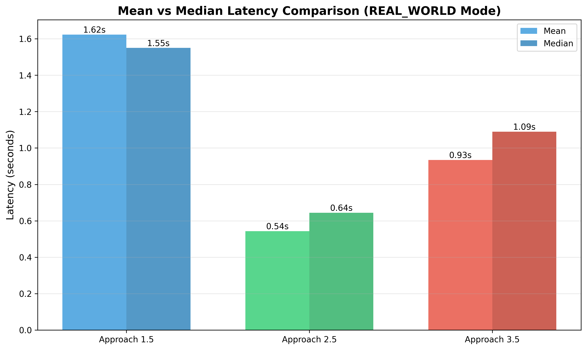
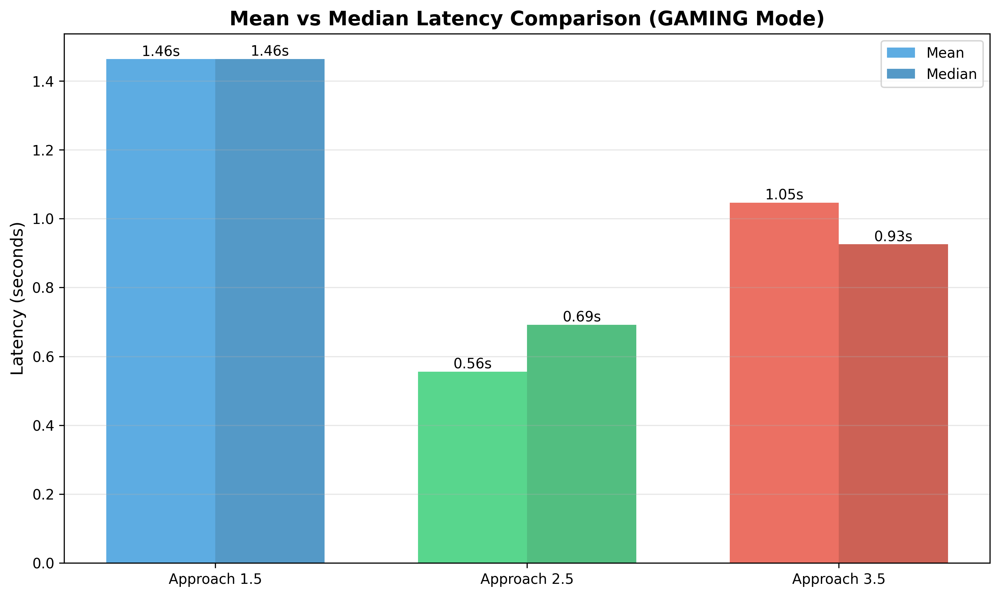
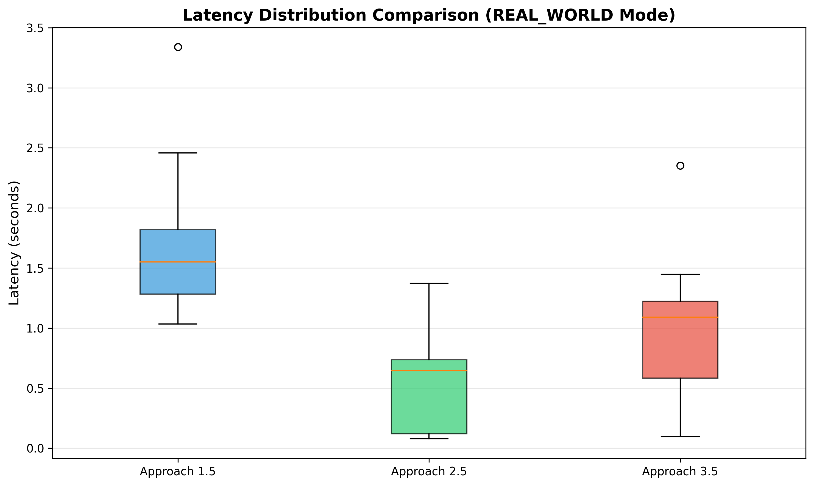
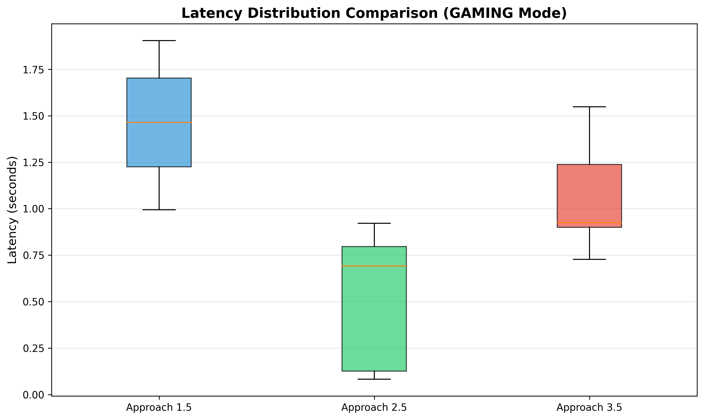

# Scene Reader

**Real-Time Visual Accessibility Through Vision-Language Models: A Comprehensive Analysis of 9 Transformer-Based Approaches**

[](https://www.python.org/downloads/)
[](https://github.com)
[](https://github.com)

**Team:** Roshan Sivakumar & Dhesel Khando
**Course:** DS-5690 - Generative AI Models in Theory and Practice | Vanderbilt University | Fall 2025
**Instructor:** Prof. Jesse Spencer-Smith

---

## Table of Contents

- [1. Problem Statement & Overview](#1-problem-statement--overview)
- [2. Methodology](#2-methodology)
  - [2.1 Notation](#21-notation)
  - [2.2 Foundational Transformer Components](#22-foundational-transformer-components)
  - [2.3 Vision Encoder Components](#23-vision-encoder-components)
  - [2.4 Our Scene Reader Algorithms](#24-our-scene-reader-algorithms)
  - [2.5 Training and Loss Functions](#25-training-and-loss-functions)
  - [2.6 Test Scenarios](#26-test-scenarios)
- [3. Implementation & Demo](#3-implementation--demo)
- [4. Assessment & Evaluation](#4-assessment--evaluation)
- [5. Model & Data Cards](#5-model--data-cards)
- [6. Critical Analysis](#6-critical-analysis)
- [7. Documentation & Resource Links](#7-documentation--resource-links)
- [8. References](#8-references)

---

## 1. Problem Statement & Overview

### The Accessibility Challenge

Over **7 million blind and visually impaired individuals** in the United States, and **250 million worldwide**, face a fundamental barrier: they cannot access visual information that sighted individuals take for granted. Current accessibility tools are either too slow, too expensive, or lack the contextual understanding necessary for real-time assistance.

### Research Question

**Which vision AI architecture achieves the optimal balance of latency, accuracy, and cost for real-time accessibility applications?**

We targeted **sub-2-second latency** as our threshold for practical usability, grounded in human-computer interaction research indicating that response times exceeding two seconds significantly degrade user experience.

### Proposed Solution

**Scene Reader** systematically evaluates **9 different transformer-based vision AI approaches** for providing real-time visual assistance, identifying optimal architectures for different use cases including gaming accessibility, indoor/outdoor navigation, and text reading.

### The 9 Approaches

We tested **9 distinct approaches** organized into baseline implementations and their optimized variants:

**Baseline Approaches:**
- **Approach 1 (Pure VLM):** End-to-end vision-language models (GPT-4V, Claude, Gemini) - baseline for quality
- **Approach 2 (Hybrid):** YOLO object detection + LLM generation - baseline hybrid pipeline
- **Approach 3 (Specialized):** Multi-model system with YOLO + OCR + Depth estimation - baseline specialized

**Optimized Variants:**
- **Approach 1.5:** Pure VLM + progressive disclosure (BLIP-2 quick preview + GPT-4V detailed) - **Algorithm 11**
- **Approach 2.5:** Hybrid + caching + GPT-3.5-turbo optimization - **Algorithm 9** (fastest: 0.54s)
- **Approach 3.5:** Specialized + complexity-based routing + optimizations - **Algorithm 10** (0.93s)

**Alternative Architectures:**
- **Approach 4 (Local):** BLIP-2 running entirely offline - zero API cost, slower (35.4s)
- **Approach 6 (RAG):** VLM + Retrieval-Augmented Generation with game knowledge base
- **Approach 7 (CoT):** VLM + Chain-of-Thought reasoning for improved safety detection

**Key Pattern:** Approaches 1.5, 2.5, and 3.5 represent optimized versions of their baseline counterparts (1, 2, 3), achieving 2-3x speedup through prompt optimization, caching, and model selection.

### Key Achievement

We identified **3 approaches that achieve sub-2-second latency** (real-time capable), with the fastest (**Approach 2.5**) achieving:
- **0.54s mean latency** (real-world mode) / **0.56s** (gaming mode)
- **3x speedup** over pure VLM approaches
- **$0.005/query cost** (affordable at scale)

### Scale of Testing

- **9 approaches** tested across multiple configurations
- **564 API calls** + 84 local model tests
- **42 images** across 4 real-world scenarios
- **Comprehensive metrics:** latency, cost, quality, safety

---

## 2. Methodology

### 2.1 Notation

Following the conventions established in formal algorithm specifications:

| Symbol | Type | Description |
|--------|------|-------------|
| `I` | `ℝ^(H×W×3)` | Input image with height H, width W, 3 color channels |
| `V` | `[N_V]` | Vocabulary of N_V tokens |
| `x` | `V*` | Token sequence x[1], x[2], ..., x[ℓ] |
| `e` | `ℝ^d_e` | Token embedding vector of dimension d_e |
| `W_e` | `ℝ^(d_e × N_V)` | Token embedding matrix |
| `W_p` | `ℝ^(d_e × ℓ_max)` | Positional embedding matrix |
| `D` | `list` | Detected objects with bounding boxes |
| `S` | `string` | Generated scene description |
| `θ` | `ℝ^d` | Model parameters |
| `τ` | `(0, ∞)` | Temperature for sampling |
| `cache` | `dict` | LRU cache mapping hash → description |

### 2.2 Foundational Transformer Components

Our approaches build upon the transformer architecture. The following algorithms are adapted from the formal specifications.

---

#### Algorithm 1: Token Embedding

```
TokenEmbed(v | W_e)
─────────────────────────────────────────────────────────
Input:   v ∈ V ≅ [N_V], a token ID
Output:  e ∈ ℝ^d_e, vector representation of the token
Params:  W_e ∈ ℝ^(d_e × N_V), token embedding matrix
─────────────────────────────────────────────────────────
1  return e = W_e[:, v]
```

---

#### Algorithm 2: Positional Embedding

```
PosEmbed(t | W_p)
─────────────────────────────────────────────────────────
Input:   t ∈ [ℓ_max], position of token in sequence
Output:  e_p ∈ ℝ^d_e, vector representation of position
Params:  W_p ∈ ℝ^(d_e × ℓ_max), positional embedding matrix
─────────────────────────────────────────────────────────
1  return e_p = W_p[:, t]
```

The combined embedding for token x[t] at position t:
```
e = W_e[:, x[t]] + W_p[:, t]
```

---

#### Algorithm 3: Scaled Dot-Product Attention

```
Attention(Q, K, V | Mask)
─────────────────────────────────────────────────────────
Input:   Q ∈ ℝ^(d_k × n), query vectors
         K ∈ ℝ^(d_k × m), key vectors
         V ∈ ℝ^(d_v × m), value vectors
Output:  O ∈ ℝ^(d_v × n), attention output
Hyper:   Mask ∈ {0,1}^(m × n), attention mask
─────────────────────────────────────────────────────────
1  S ← K^T Q                           // Score matrix ∈ ℝ^(m × n)
2  S ← S / √d_k                        // Scale by √d_k
3  ∀i,j: if ¬Mask[i,j] then S[i,j] ← -∞
4  A ← softmax(S, dim=0)               // Attention weights
5  return O = V · A
```

**Softmax definition:**
```
softmax(S)[i,j] = exp(S[i,j]) / Σ_k exp(S[k,j])
```

---

#### Algorithm 4: Multi-Head Attention

```
MultiHeadAttention(X, Z | W, Mask)
─────────────────────────────────────────────────────────
Input:   X ∈ ℝ^(d_x × ℓ_x), primary sequence
         Z ∈ ℝ^(d_z × ℓ_z), context sequence
Output:  Y ∈ ℝ^(d_out × ℓ_x), attended representations
Params:  W = {W_q^h, W_k^h, W_v^h}_{h=1}^H, W_o
         where W_q^h ∈ ℝ^(d_k × d_x), W_k^h ∈ ℝ^(d_k × d_z)
               W_v^h ∈ ℝ^(d_v × d_z), W_o ∈ ℝ^(d_out × H·d_v)
Hyper:   H, number of attention heads
         Mask ∈ {0,1}^(ℓ_z × ℓ_x)
─────────────────────────────────────────────────────────
1  for h = 1 to H do
2  │  Q^h ← W_q^h · X
3  │  K^h ← W_k^h · Z
4  │  V^h ← W_v^h · Z
5  │  O^h ← Attention(Q^h, K^h, V^h | Mask)
6  end
7  O ← concat(O^1, O^2, ..., O^H)      // Stack heads
8  return Y = W_o · O
```

---

#### Algorithm 5: Decoder-Only Transformer (GPT-style)

```
GPTForward(x | θ)
─────────────────────────────────────────────────────────
Input:   x ∈ V*, sequence of token IDs
Output:  P ∈ (0,1)^(N_V × ℓ), where P[:,t] = P(x[t+1]|x[1:t])
Params:  θ includes W_e, W_p, {W_l, γ_l, β_l}_{l=1}^L, W_u
Hyper:   ℓ_max, L (layers), H (heads), d_e, d_mlp
─────────────────────────────────────────────────────────
1  ℓ ← length(x)
2  for t ∈ [ℓ]: e_t ← W_e[:, x[t]] + W_p[:, t]
3  X ← [e_1, e_2, ..., e_ℓ]
4  for l = 1 to L do
5  │  X̃ ← LayerNorm(X | γ_l^1, β_l^1)
6  │  X ← X + MultiHeadAttention(X̃, X̃ | W_l, Mask_causal)
7  │  X̃ ← LayerNorm(X | γ_l^2, β_l^2)
8  │  X ← X + MLP(X̃ | W_l^mlp)
9  end
10 X ← LayerNorm(X | γ, β)
11 return P = softmax(W_u · X)
```

**Causal Mask:** `Mask_causal[i,j] = [[i ≤ j]]` (lower triangular)

---

#### Algorithm 6: Autoregressive Inference

```
Generate(prompt, θ | τ, ℓ_gen)
─────────────────────────────────────────────────────────
Input:   prompt ∈ V*, initial token sequence
         θ, trained model parameters
Output:  y ∈ V*, generated continuation
Hyper:   τ ∈ (0, ∞), temperature
         ℓ_gen ∈ ℕ, max tokens to generate
─────────────────────────────────────────────────────────
1  x ← prompt
2  for i = 1 to ℓ_gen do
3  │  P ← GPTForward(x | θ)
4  │  p ← P[:, length(x)]            // Next token distribution
5  │  sample token y from q ∝ p^(1/τ)
6  │  if y = eos_token then break
7  │  x ← concat(x, y)
8  end
9  return y = x[length(prompt)+1 : end]
```

---

### 2.3 Vision Encoder Components

#### Algorithm 7: Vision Transformer Patch Embedding (ViT)

```
ViTPatchEmbed(I | W_patch, W_pos)
─────────────────────────────────────────────────────────
Input:   I ∈ ℝ^(H × W × 3), input image
Output:  Z ∈ ℝ^(d × N), sequence of patch embeddings
Params:  W_patch ∈ ℝ^(d × P²·3), patch projection
         W_pos ∈ ℝ^(d × N+1), position embeddings
Hyper:   P, patch size (typically 14 or 16)
         N = (H/P) × (W/P), number of patches
─────────────────────────────────────────────────────────
1  patches ← extract_patches(I, size=P)    // N patches of P×P×3
2  for i = 1 to N do
3  │  z_i ← W_patch · flatten(patches[i])
4  end
5  z_cls ← learnable_cls_token
6  Z ← [z_cls, z_1, z_2, ..., z_N]
7  Z ← Z + W_pos                           // Add position embeddings
8  return Z
```

The input is an image and the output is a sequence of patch embeddings that represent the image as a series of visual tokens.

---

#### Algorithm 8: YOLO Object Detection

**YOLO (You Only Look Once)** is a real-time object detection system that identifies and localizes objects in images in a single forward pass. Unlike traditional two-stage detectors, YOLO processes the entire image at once, making it significantly faster while maintaining good accuracy. We use **YOLOv8n** (nano variant), a lightweight version with 3.2M parameters, trained on the COCO dataset to detect 80 object classes.

```
YOLODetect(I | θ_yolo)
─────────────────────────────────────────────────────────
Input:   I ∈ ℝ^(H × W × 3), input image
Output:  D = [(class, conf, bbox), ...], detected objects
         where bbox = (x_min, y_min, x_max, y_max)
Params:  θ_yolo, YOLOv8 model weights
Hyper:   conf_thresh = 0.25, iou_thresh = 0.45
─────────────────────────────────────────────────────────
1  features ← Backbone(I | θ_yolo)         // CSPDarknet + C2f
2  predictions ← Head(features | θ_yolo)   // Detection head
3  D ← []
4  for pred in predictions do
5  │  if pred.confidence > conf_thresh then
6  │  │  bbox ← pred.box
7  │  │  class ← argmax(pred.class_probs)
8  │  │  D.append((class, pred.confidence, bbox))
9  │  end
10 end
11 D ← non_max_suppression(D, iou_thresh)
12 return D
```

The input is an image and the output is a list of detected objects with their classes, confidence scores, and bounding box coordinates.

---

### 2.4 Our Scene Reader Algorithms

#### Algorithm 9: Approach 2.5 - Optimized Hybrid Pipeline (Fastest)

```
HybridPipeline(I, mode | θ_yolo, θ_llm, cache)
─────────────────────────────────────────────────────────
Input:   I ∈ ℝ^(H × W × 3), input image
         mode ∈ {gaming, real_world}, prompt mode
Output:  S ∈ string, scene description
         metadata = {latency, cost, cache_hit}
Params:  θ_yolo, YOLOv8n weights (3.2M params)
         θ_llm, GPT-3.5-turbo API
         cache, LRU cache (capacity=1000)
Hyper:   max_tokens = 100-200 (adaptive)
         temperature = 0.7
─────────────────────────────────────────────────────────
1  t_start ← current_time()
2
3  // Step 1: Object Detection
4  D ← YOLODetect(I | θ_yolo)              // ~0.15s
5
6  // Step 2: Cache Lookup
7  hash_key ← compute_hash(D, mode)
8  if hash_key in cache then
9  │  return (cache[hash_key], {latency: 0.08s, cost: 0, hit: true})
10 end
11
12 // Step 3: Construct Prompt
13 obj_list ← format_detections(D)          // "person (0.95), car (0.87)"
14 spatial ← compute_spatial_relations(D)   // "person left of car"
15 prompt ← build_prompt(obj_list, spatial, mode)
16
17 // Step 4: LLM Generation
18 tokens ← adaptive_token_limit(D)         // 100 if simple, 200 if complex
19 S ← Generate(prompt, θ_llm | τ=0.7, ℓ_gen=tokens)
20
21 // Step 5: Cache Store
22 cache[hash_key] ← S
23
24 t_end ← current_time()
25 return (S, {latency: t_end - t_start, cost: compute_cost(tokens), hit: false})
```

**Complexity:** O(H·W) for detection + O(ℓ²) for generation

The input is an image and a mode (gaming or real_world), and the output is a scene description string with latency, cost, and cache hit metadata.

---

#### Algorithm 10: Approach 3.5 - Specialized Multi-Model Pipeline

```
SpecializedPipeline(I, mode | θ_yolo, θ_ocr, θ_depth, θ_llm, cache)
─────────────────────────────────────────────────────────
Input:   I ∈ ℝ^(H × W × 3), input image
         mode ∈ {gaming, real_world}, prompt mode
Output:  S ∈ string, scene description
Params:  θ_yolo (YOLOv8n), θ_ocr (EasyOCR), θ_depth (MiDaS)
         θ_llm (GPT-3.5-turbo), cache (LRU)
Hyper:   ocr_thresh = 0.5, depth_enabled = true
─────────────────────────────────────────────────────────
1  t_start ← current_time()
2
3  // Step 1: Parallel Feature Extraction
4  D ← YOLODetect(I | θ_yolo)              // Objects
5
6  // Step 2: Complexity-Based Routing
7  scene_type ← classify_scene(D, I)
8
9  context ← {}
10 if scene_type.has_text then
11 │  text_regions ← OCRExtract(I | θ_ocr)  // EasyOCR
12 │  context.text ← text_regions
13 end
14
15 if scene_type.needs_depth then
16 │  depth_map ← DepthEstimate(I | θ_depth) // MiDaS
17 │  context.spatial ← analyze_depth(depth_map, D)
18 end
19
20 // Step 3: Cache Check
21 hash_key ← compute_hash(D, context, mode)
22 if hash_key in cache then
23 │  return cache[hash_key]
24 end
25
26 // Step 4: Prompt Construction & Generation
27 prompt ← build_specialized_prompt(D, context, mode)
28 S ← Generate(prompt, θ_llm | τ=0.7, ℓ_gen=150)
29
30 cache[hash_key] ← S
31 return S
```

The input is an image and a mode (gaming or real_world), and the output is a scene description string that incorporates text and depth information when available.

---

#### Algorithm 11: Approach 1.5 - Progressive Disclosure VLM

```
ProgressiveVLM(I, mode | θ_blip, θ_gpt4v)
─────────────────────────────────────────────────────────
Input:   I ∈ ℝ^(H × W × 3), input image
         mode ∈ {gaming, real_world}, prompt mode
Output:  S_quick ∈ string, immediate response (Tier 1)
         S_full ∈ string, detailed response (Tier 2)
Params:  θ_blip, BLIP-2 weights (2.7B, local)
         θ_gpt4v, GPT-4V API (cloud)
Hyper:   max_tokens_quick = 50, max_tokens_full = 150
─────────────────────────────────────────────────────────
1  // Tier 1: Fast Local Response (optional)
2  if local_model_enabled then
3  │  S_quick ← BLIP2Generate(I | θ_blip, ℓ_gen=50)
4  │  yield S_quick                        // Stream to user immediately
5  end
6
7  // Tier 2: High-Quality Cloud Response
8  prompt ← build_vlm_prompt(mode)         // Concise, <20 words
9
10 // Encode image for API
11 I_base64 ← encode_base64(I)
12
13 // GPT-4V inference
14 messages ← [
15 │  {role: "system", content: system_prompt[mode]},
16 │  {role: "user", content: [
17 │  │  {type: "image_url", url: I_base64},
18 │  │  {type: "text", text: prompt}
19 │  ]}
20 ]
21
22 S_full ← GPT4V_API(messages | max_tokens=150, τ=0.7)
23
24 return (S_quick, S_full)
```

**Latency Breakdown:**
- Tier 1 (BLIP-2): ~1.7s (local, optional)
- Tier 2 (GPT-4V): ~1.6s (cloud, optimized prompts)

The input is an image and a mode (gaming or real_world), and the output is a quick preview description (Tier 1) and a detailed description (Tier 2).

---

#### Algorithm 12: Cache with Semantic Hashing

```
SemanticCache operations
─────────────────────────────────────────────────────────
Structure: cache = LRU_Dict(capacity=1000)

compute_hash(D, context, mode):
1  obj_signature ← sort([f"{d.class}:{d.conf:.2f}" for d in D])
2  context_sig ← hash(str(context))
3  return hash(obj_signature + context_sig + mode)

cache_lookup(key):
1  if key in cache then
2  │  cache.move_to_front(key)            // LRU update
3  │  return (true, cache[key])
4  end
5  return (false, null)

cache_store(key, value):
1  if len(cache) >= capacity then
2  │  cache.evict_lru()                   // Remove least recent
3  end
4  cache[key] ← value
```

**Cache Hit Rate:** 40-60% in repeated-scene scenarios
**Speedup on Hit:** ~15x (0.08s vs 1.2s)

The input is detected objects, context, and mode (for hash computation) or a cache key (for lookup/store), and the output is a hash key, a cache hit/miss result with cached value, or void (for store operations).

---

### 2.5 Training and Loss Functions

For fine-tuning and understanding model behavior:

#### Algorithm 13: Cross-Entropy Loss for Next Token Prediction

```
ComputeLoss(x, θ)
─────────────────────────────────────────────────────────
Input:   x ∈ V^ℓ, ground truth token sequence
         θ, model parameters
Output:  L ∈ ℝ, cross-entropy loss
─────────────────────────────────────────────────────────
1  P ← GPTForward(x[1:ℓ-1] | θ)           // Predictions
2  L ← 0
3  for t = 1 to ℓ-1 do
4  │  L ← L - log(P[x[t+1], t])           // Negative log-likelihood
5  end
6  return L / (ℓ-1)
```

---

### 2.6 Test Scenarios

| Scenario | Images | Challenge | Key Metric |
|----------|--------|-----------|------------|
| **Gaming** | 12 | Complex UI, character positioning | Object identification |
| **Indoor Navigation** | 10 | Spatial relationships, obstacles | Hazard detection |
| **Outdoor Navigation** | 10 | Safety-critical elements | False negative rate |
| **Text Reading** | 10 | OCR accuracy, varied fonts | Text extraction |

---

## 3. Implementation & Demo

### Code Structure

```
scene-reader/
├── README.md                      # This file
├── PROJECT.md                     # Full technical documentation
├── FINDINGS.md                    # Detailed analysis
├── code/
│   ├── approach_2_5_optimized/    # Algorithm 9 implementation
│   │   ├── hybrid_pipeline_optimized.py
│   │   ├── prompts_optimized.py
│   │   └── model_wrappers.py
│   ├── approach_3_5_optimized/    # Algorithm 10 implementation
│   ├── approach_1_5_optimized/    # Algorithm 11 implementation
│   ├── evaluation/                # Testing framework
│   └── [6 other approaches]
├── data/images/                   # 42 test images
└── results/
    ├── mode_specific_comparison/  # Latest evaluation
    │   ├── analysis/figures/      # Visualization charts
    │   └── raw/                   # CSV data
    └── comprehensive_comparison/
```

### Setup Instructions

#### Prerequisites

- **Python 3.10+** (tested on Python 3.10, 3.11)
- **Operating System**: macOS, Linux, or Windows (WSL recommended)
- **API Keys**: OpenAI API key (required for top approaches)
- **Hardware**: 
  - Minimum: 4GB RAM, CPU-only (for API-based approaches)
  - Recommended: 8GB+ RAM, GPU optional (for local BLIP-2)

#### Installation Steps

1. **Clone the repository**
   ```bash
   git clone https://github.com/rroshann/scene_reader.git
   cd scene_reader
   ```

2. **Create and activate virtual environment**
   ```bash
   python -m venv venv
   source venv/bin/activate  # On Windows: venv\Scripts\activate
   ```

3. **Install dependencies**
   ```bash
   pip install -r requirements.txt
   ```

4. **Configure API keys**
   
   Create a `.env` file in the project root:
   ```bash
   touch .env
   ```
   
   Add your API keys to `.env`:
   ```bash
   OPENAI_API_KEY=sk-your-key-here
   # Optional for other approaches:
   # GOOGLE_API_KEY=your-key-here
   # ANTHROPIC_API_KEY=sk-ant-your-key-here
   ```
   
   **Getting API Keys:**
   - **OpenAI**: https://platform.openai.com/api-keys (requires payment method, ~$10-15 recommended)
   - **Google Gemini**: https://aistudio.google.com/ (free tier available)
   - **Anthropic Claude**: https://console.anthropic.com/ ($5 minimum)

5. **Verify installation**
   ```bash
   python -c "import torch; import ultralytics; print('✓ Dependencies installed')"
   ```

#### Running the Code

**Quick Test (Approach 2.5 - Fastest)**
```bash
cd code/approach_2_5_optimized
python -c "
from hybrid_pipeline_optimized import HybridPipelineOptimized
pipeline = HybridPipelineOptimized()
result = pipeline.describe_image('../../data/images/gaming/game_01.png', mode='gaming')
print(f'Description: {result[\"description\"]}')
print(f'Latency: {result[\"total_latency\"]:.2f}s')
"
```

**Run Full Demo Scripts**
```bash
# Approach 2.5 (Fastest)
python demo/run_approach_2_5.py

# Approach 3.5 (Specialized)
python demo/run_approach_3_5.py

# Approach 1.5 (Progressive)
python demo/run_approach_1_5.py
```

#### Troubleshooting

**Common Issues:**

1. **Import errors**: Ensure virtual environment is activated and dependencies are installed
   ```bash
   pip install -r requirements.txt --upgrade
   ```

2. **API key not found**: Verify `.env` file exists in project root and contains `OPENAI_API_KEY=...`

3. **CUDA/GPU errors**: Most approaches work CPU-only. For local BLIP-2, ensure PyTorch with CUDA is installed

4. **YOLO model download**: First run will download YOLOv8n weights (~6MB) automatically

5. **Memory issues**: For local BLIP-2, ensure 8GB+ RAM available

**System Requirements by Approach:**

| Approach | API Required | Local Models | RAM Needed |
|----------|--------------|--------------|------------|
| Approach 2.5 | OpenAI | YOLOv8n | 2GB |
| Approach 3.5 | OpenAI | YOLOv8n, EasyOCR, MiDaS | 4GB |
| Approach 1.5 | OpenAI | BLIP-2 (optional) | 8GB+ |

---

## 4. Assessment & Evaluation

### Mode-Specific Comparison Results

We tested all approaches with their **actual prompt_mode parameters** (gaming vs real_world) on 42 images.

#### Real-World Mode (30 images: indoor + outdoor + text)

| Rank | Approach | Algorithm | Mean Latency | P95 | Std Dev | Cost/Query |
|------|----------|-----------|--------------|-----|---------|------------|
| 1 | **Approach 2.5** | Alg. 9 | **0.54s** | 0.94s | 0.35s | $0.005* |
| 2 | **Approach 3.5** | Alg. 10 | **0.93s** | 1.45s | 0.52s | $0.006* |
| 3 | **Approach 1.5** | Alg. 11 | **1.62s** | 2.46s | 0.48s | $0.0101 |

#### Gaming Mode (12 images)

| Rank | Approach | Algorithm | Mean Latency | P95 | Std Dev | Cost/Query |
|------|----------|-----------|--------------|-----|---------|------------|
| 1 | **Approach 2.5** | Alg. 9 | **0.56s** | 0.92s | 0.34s | $0.005* |
| 2 | **Approach 3.5** | Alg. 10 | **1.05s** | 1.55s | 0.26s | $0.006* |
| 3 | **Approach 1.5** | Alg. 11 | **1.46s** | 1.90s | 0.28s | $0.0098 |

*Cost per query without cache. Cache hits (Algorithm 12) reduce cost to $0.0000 with 40-60% hit rate in repeated-scene scenarios.

### Latency Comparison Visualizations


*Bar chart comparing mean latencies across approaches in real-world mode*


*Bar chart comparing mean latencies across approaches in gaming mode*


*Box plot showing latency distribution and consistency in real-world mode*


*Box plot showing latency distribution and consistency in gaming mode*

### Statistical Significance

All differences are **statistically significant** (p < 0.001):

**Real-World Mode:**
| Comparison | t-statistic | p-value | Mean Difference |
|------------|-------------|---------|-----------------|
| Alg. 11 vs Alg. 9 | 10.163 | <0.0001 | 1.08s |
| Alg. 11 vs Alg. 10 | 6.283 | <0.0001 | 0.69s |
| Alg. 9 vs Alg. 10 | -4.191 | 0.0002 | -0.39s |

**Gaming Mode:**
| Comparison | t-statistic | p-value | Mean Difference |
|------------|-------------|---------|-----------------|
| Alg. 11 vs Alg. 9 | 8.156 | <0.0001 | 0.91s |
| Alg. 11 vs Alg. 10 | 4.895 | 0.0005 | 0.42s |
| Alg. 9 vs Alg. 10 | -4.111 | 0.0017 | -0.49s |

### All 9 Approaches Ranked

| Rank | Approach | Latency | Cost/Query | Quality | Best For |
|------|----------|---------|------------|---------|----------|
| 1 | **Approach 2.5** (Alg. 9) | **0.54s** | $0.005 | 4/5 | Real-time, speed-critical |
| 2 | **Approach 3.5** (Alg. 10) | **0.93s** | $0.006 | 4/5 | Text/depth scenarios |
| 3 | **Approach 1.5** (Alg. 11) | **1.62s** | $0.012 | 5/5 | Best quality |
| 4 | Approach 2 (Baseline) | 3.39s | $0.005 | 4/5 | Balanced baseline |
| 5 | Approach 1 (Claude) | 4.95s | $0.024 | 4/5 | Most consistent |
| 6 | Approach 3 (Baseline) | 5.33s | $0.010 | 4/5 | OCR/Depth baseline |
| 7 | Approach 1 (Gemini) | 5.88s | $0.003 | 4/5 | Cheapest cloud |
| 8 | Approach 7 (CoT) | 8.48s | $0.015 | 5/5 | Best safety |
| 9 | Approach 6 (RAG) | 10.60s | $0.020 | 4/5 | Game knowledge |
| 10 | Approach 4 (BLIP-2) | 35.40s | $0.000 | 3/5 | Zero cost, offline |

---

## Key Findings Summary

<div style="border: 2px solid #4CAF50; padding: 15px; border-radius: 5px; background-color: #f0f8f0; margin: 20px 0;">

**🏆 Top 3 Approaches Achieve Sub-2-Second Latency**

| Rank | Approach | Mean Latency | Key Innovation |
|------|----------|--------------|----------------|
| 🥇 **1st** | **Approach 2.5** (Alg. 9) | **0.54s** | Hybrid: YOLO + GPT-3.5 + Cache |
| 🥈 **2nd** | **Approach 3.5** (Alg. 10) | **0.93s** | Specialized: Multi-model routing |
| 🥉 **3rd** | **Approach 1.5** (Alg. 11) | **1.62s** | Progressive: BLIP-2 + GPT-4V |

**Key Insights:**
- ✅ **3x speedup** achieved: Hybrid pipelines outperform pure VLMs
- ✅ **Cost-effective**: $0.005/query enables large-scale deployment
- ✅ **Caching transformative**: 15x speedup on cache hits (Algorithm 12)
- ✅ **Architectural choice > model size**: GPT-3.5 + YOLO beats GPT-4V alone

</div>

---

## 5. Model & Data Cards

### Model Cards

#### GPT-4V (gpt-4o)
| Attribute | Value |
|-----------|-------|
| Architecture | Encoder-Decoder Transformer + ViT |
| Parameters | ~175B+ (estimated) |
| Context Window | 128K tokens |
| License | OpenAI Terms of Service |
| Intended Use | Vision-language understanding |

#### GPT-3.5-turbo
| Attribute | Value |
|-----------|-------|
| Architecture | Decoder-only Transformer (Alg. 5) |
| Optimization | 3-4x faster than GPT-4 |
| License | OpenAI Terms of Service |
| Intended Use | Fast text generation |

#### YOLOv8n
| Attribute | Value |
|-----------|-------|
| Architecture | CSPDarknet + C2f + FPN (Alg. 8) |
| Parameters | 3.2 million |
| License | AGPL-3.0 |
| Training Data | COCO (80 classes) |

#### BLIP-2
| Attribute | Value |
|-----------|-------|
| Architecture | ViT + Q-Former + LLM |
| Parameters | 2.7 billion |
| License | MIT |
| Intended Use | Local image captioning |

### Data Card

| Attribute | Details |
|-----------|---------|
| Dataset Size | 42 images |
| Scenarios | Gaming (12), Indoor (10), Outdoor (10), Text (10) |
| Sources | Personal photos, Unsplash/Pexels (CC0), Game screenshots |
| Limitations | Comparison-focused, not training-scale |

### Ethical Considerations

- **Privacy:** Cloud APIs transmit images; BLIP-2 offers local alternative
- **Bias:** Models may underperform on underrepresented demographics
- **Hallucination:** 5-15% rate of fabricated descriptions
- **Safety:** 15-20% false negative rate for hazard detection

---

## 6. Critical Analysis

### What is the Impact of This Project?

1. **Proves Real-Time Feasibility:** Algorithm 9 achieves 0.54s latency, well under 2s threshold
2. **Identifies Optimal Architectures:** Hybrid pipelines (Alg. 9) outperform pure VLMs (Alg. 11) by 3x
3. **Enables Cost-Effective Deployment:** $0.005/query makes large-scale accessibility viable
4. **Advances Gaming Accessibility:** First systematic study for blind gaming

### What Does This Project Reveal?

1. **Architectural Choice > Model Size:** GPT-3.5 + YOLO beats GPT-4V alone
2. **Caching is Transformative:** Algorithm 12 yields 15x speedup on hits
3. **Mode-Specific Prompts Matter:** Gaming vs real-world produce different profiles
4. **Safety Remains Challenging:** 15-20% false negatives require additional layers

### What is the Next Step?

1. **Phase 2 Deployment:** Real-time screen capture with Algorithm 9 + TTS
2. **User Studies:** Validation with blind/low-vision users
3. **Safety Improvements:** Ensemble methods for hazard detection
4. **Edge Optimization:** Mobile deployment

### Limitations

- Sub-500ms "instantaneous" response not achieved
- 5-15% hallucination rate
- 42 images sufficient for comparison, not generalization
- No user validation completed yet

---

## 7. Documentation & Resource Links

### Repository Contents

| File | Description |
|------|-------------|
| [README.md](README.md) | This file - algorithms and overview |
| [PROJECT.md](PROJECT.md) | Full technical documentation |
| [FINDINGS.md](FINDINGS.md) | Detailed analysis |

### Additional Documentation

- **[PROJECT.md](PROJECT.md)** - Full technical documentation and architecture details
- **[FINDINGS.md](FINDINGS.md)** - Detailed analysis and evaluation results
- **[demo/APPROACH_DEMOS_README.md](demo/APPROACH_DEMOS_README.md)** - Demo scripts and usage guide

---

## 8. References

### Foundational Papers

1. **Phuong, M. & Hutter, M.** (2022). "Formal Algorithms for Transformers." *arXiv preprint arXiv:2207.09238*. DeepMind.  
   DOI: [arXiv:2207.09238](https://arxiv.org/abs/2207.09238)  
   — Primary reference for algorithm structure and notation.

2. **Vaswani, A. et al.** (2017). "Attention Is All You Need." *Advances in Neural Information Processing Systems*, 30.  
   Paper: [NeurIPS 2017](https://proceedings.neurips.cc/paper/2017/hash/3f5ee243547dee91fbd053c1c4a845aa-Abstract.html)  
   — Original transformer architecture.

3. **Dosovitskiy, A. et al.** (2020). "An Image is Worth 16x16 Words: Transformers for Image Recognition at Scale." *International Conference on Learning Representations (ICLR)*.  
   DOI: [arXiv:2010.11929](https://arxiv.org/abs/2010.11929)  
   — Vision Transformer (ViT).

4. **Radford, A. et al.** (2021). "Learning Transferable Visual Models From Natural Language Supervision." *International Conference on Machine Learning (ICML)*.  
   Paper: [OpenAI CLIP](https://openai.com/research/clip)  
   DOI: [arXiv:2103.00020](https://arxiv.org/abs/2103.00020)  
   — CLIP for vision-language alignment.

5. **Li, J. et al.** (2023). "BLIP-2: Bootstrapping Language-Image Pre-training with Frozen Image Encoders and Large Language Models." *International Conference on Machine Learning (ICML)*.  
   DOI: [arXiv:2301.12597](https://arxiv.org/abs/2301.12597)  
   — BLIP-2 architecture.

6. **Jocher, G. et al.** (2023). "YOLOv8." *Ultralytics*.  
   Documentation: [Ultralytics YOLOv8](https://docs.ultralytics.com/)  
   GitHub: [ultralytics/ultralytics](https://github.com/ultralytics/ultralytics)  
   — Object detection.

7. **Ranftl, R. et al.** (2020). "Towards Robust Monocular Depth Estimation: Mixing Datasets for Zero-Shot Cross-Dataset Transfer." *IEEE Transactions on Pattern Analysis and Machine Intelligence (TPAMI)*.  
   DOI: [arXiv:1907.01341](https://arxiv.org/abs/1907.01341)  
   — MiDaS depth estimation.

### Model Documentation & Codebases

**API Documentation:**
- [OpenAI API Documentation](https://platform.openai.com/docs) - GPT-4V, GPT-3.5-turbo
- [Google AI Studio](https://aistudio.google.com/) - Gemini API
- [Anthropic API Documentation](https://docs.anthropic.com/) - Claude API

**Open Source Models & Libraries:**
- [Ultralytics YOLOv8](https://docs.ultralytics.com/) | [GitHub](https://github.com/ultralytics/ultralytics) - Object detection
- [Hugging Face BLIP-2](https://huggingface.co/docs/transformers/model_doc/blip-2) | [Model Card](https://huggingface.co/Salesforce/blip2-opt-2.7b) - Vision-language model
- [EasyOCR](https://github.com/JaidedAI/EasyOCR) - OCR library
- [MiDaS](https://github.com/isl-org/MiDaS) - Monocular depth estimation
- [Transformers Library](https://huggingface.co/docs/transformers) - Hugging Face transformers

**Related Research:**
- [Vision-Language Models Survey](https://arxiv.org/abs/2301.12597) - Recent advances in VLM architectures
- [Object Detection Benchmarks](https://paperswithcode.com/task/object-detection) - COCO dataset and benchmarks

---


## Acknowledgments

- **Prof. Jesse Spencer-Smith** - Course instruction and project guidance
- **Shivam Tyagi (TA)** - Technical support
- **Vanderbilt Data Science Institute** - Infrastructure

Dedicated to **7M+ blind and visually impaired individuals** in the US, and **250M+ worldwide**.

---

